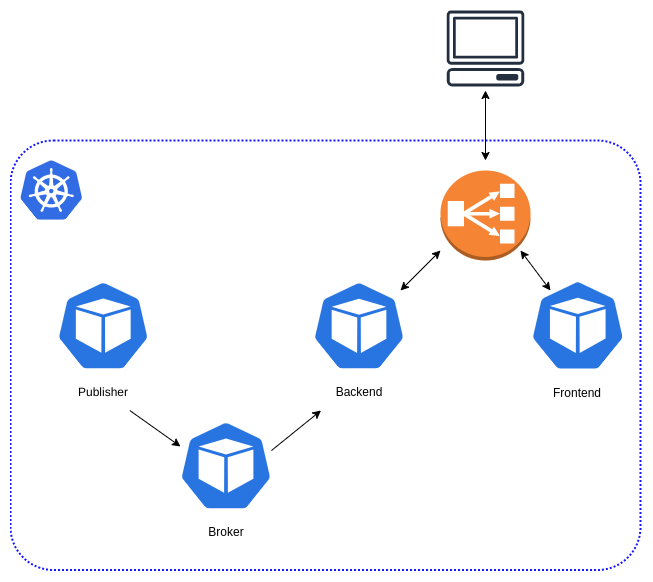

# mqtt-pub-sub-go

a sample distributed application to demonstrate microservice concepts on kubernetes.

The application consists of an MQTT message broker, providing a message queue, to which an arbitrary amount of publishers (written in go) can send messages. One backend service (go) subscribes to the messages, and provides the messages via a REST API.
A frontend (reactjs) connects to the REST API and shows the messages.
In addition, publishers are used to demonstrate how a kubernetes cronjob can be used to execute containers at scheduled intervals.

This application is used to demonstrate various kubernetes concepts, such as deployments, services, ingress, cronjobs, configmaps, etc.

The MQTT broker used is the free and high performance MQTT broker from [https://github.com/fhmq/hmq](https://github.com/fhmq/hmq), which is licensed under [Apache License 2.0](https://github.com/fhmq/hmq/blob/55f1f1aa8001b422e4e648cf8240a2bdf0dbfd52/LICENSE)

## building

Update the broker submodule with: `git submodule update --init --recursive`  
Each service has a `Dockerfile`, which is used to build the service container.
The `Makefile` contains multiple tasks to build the application, containers, and also to ease deployments to kubernetes clusters.

### requirements

this has been used with AWS EKS Kubernetes, but should run on any kubernetes cluster.
You need to have a container registry to which you can push the container images.
You also need access to the kubernetes cluster using `kubectl`.

### adjustments

if you want to deploy this to your kubernetes cluster, make sure to set the REGISTRY_URL and image urls in the kubernetes deployment manifests to point to the location of your container registry.

